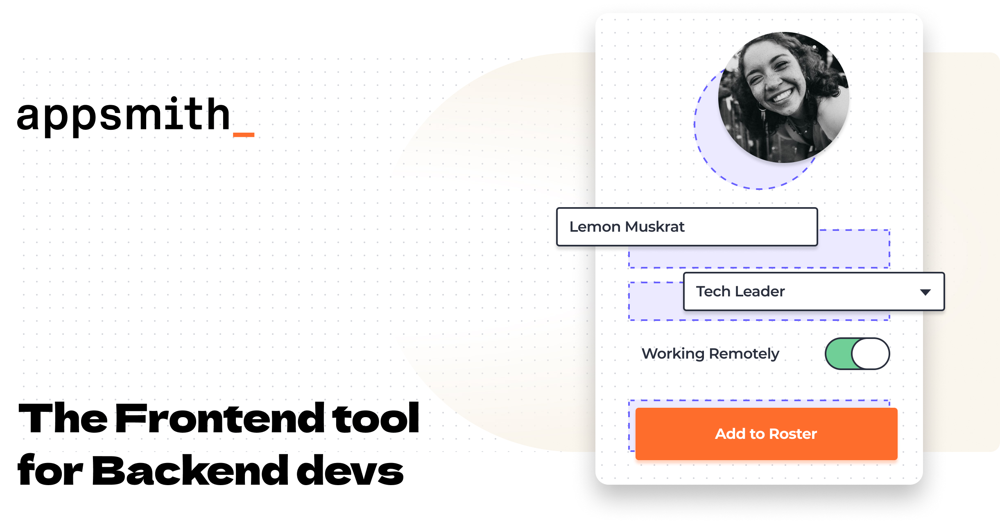
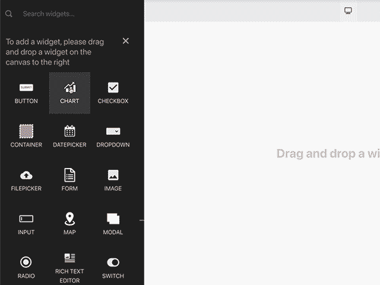
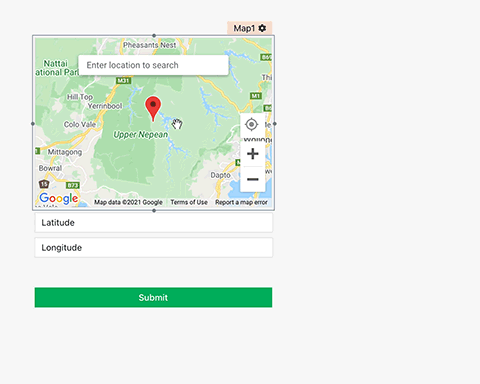
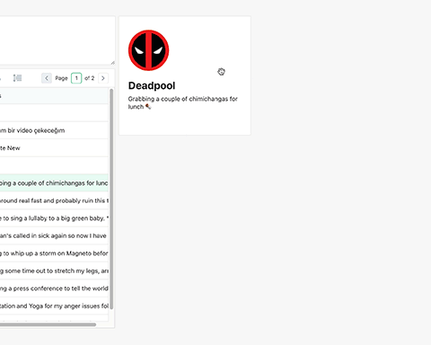

  <b><a href="https://app.appsmith.com/signup">Start Building</a></b>
    •
  <a href="https://www.appsmith.com/">Features</a>
    •
  <a href="https://docs.appsmith.com/">Documentation</a>
   
   
  Turn any datasource into an internal app in minutes. Appsmith lets you drag-and-drop components to build UI, write logic with JavaScript objects and connect to any API, database or GraphQL source.
   
   

## Quick Start

The fastest way to start with Appsmith is to try the cloud-hosted version. When you're ready, you can also host it yourself.

* Start building apps *2 minutes* with [Appsmith Cloud](https://bit.ly/appsmith-signup-github)
* Install locally or on a private instance with [Docker](https://docs.appsmith.com/setup/docker) (Recommended)
* Deploy on a [Kubernetes](https://docs.appsmith.com/setup/kubernetes) cluster
* Deploy to [AWS with an AMI](https://docs.appsmith.com/setup/aws-ami) on the marketplace
* One-click deploy to [Heroku](https://docs.appsmith.com/setup/heroku)

## Features

  
  
  

#### Drag & Drop UI
Use ready components to build dashboards and workflows in record time, without a single line of code. Most common elements are available—tables, charts, forms, maps, images, videos and more can be dropped right into your app.

#### Integrations
Appsmith automagically works using any DB, Rest API or GraphQL as a datasource, with added support for OAuth 2.0 and CURL. We've pre-built integrations for PostgreSQL, MongoDB, MySQL, Firestore, S3, Redshift, Elastic Search, DynamoDB, Redis, and MSFT SQL Server.
 

#### JavaScript Everywhere
Every part of your app can be referenced as a JavaScript object. Code interactions between elements, update one datasource from another or manipulate SQL queries—we'll parse JS anywhere.

#### One-click Deploy with Access Control
Once you're done building your app, publishing it is as easy as pushing a button. Make the app public and get a shareable link, or privately invite your team to use it with OAuth 2.0 support. Each member can be assigned a role, you choose what they can access.

#### 256-bits of Security
Whenever you add a datasource to Appsmith Cloud, your credentials are secured end-to-end with an AES 256 encryption. Your data is your own, we don't store *any* of it. For even greater security, try one of our [self-hosted options](https://docs.appsmith.com/setup).

#### Transparent Support for All
Issues are inevitable. Whenever you have one, our entire team is available on [Discord](https://discord.gg/rBTTVJp) to help. You may also choose to open an issue right here on [GitHub](https://github.com/appsmithorg/appsmith/issues/new/choose), or find a solution in our [Documentation](https://docs.appsmith.com)

## 📺 Demo

Unsure if Appsmith is for you? [Watch it in action here](http://bit.ly/appsmith-demo-github)

But if you’d rather check out some real applications that can be built with Appsmith, check below:
* [Customer Support Dashboard](https://bit.ly/cs-dashboard-appsmith)
* [Job Application Tracker](https://bit.ly/3hbYtTi)

## 🏃‍♀️ Quickstart

The following steps introduce you to building a simple user-list dashboard on Appsmith.
1. [Sign up on Appsmith Cloud](https://bit.ly/appsmith-signup-github) or [Deploy Appsmith](https://docs.appsmith.com/setup).
2. Create a new app within the organization that has already been created for you.
3. Click on the `+` icon next to the `Queries` section to add a new query in the mock database
    1. Name the query `usersQuery`.
    2. Write the query `select * from users limit 5;`.
    3. Run the query.
4. Click on the `+` icon next to the `Widgets` section and drag a table onto the screen
5. Link the table data property to the `usersQuery` using JavaScript `{{usersQuery.data}}`
6. Hit the Deploy button and checkout the view mode of the app.

Congratulations 🎉 You just built your first app on Appsmith!
Connect your own data to build apps for your team. [Read more here.](https://docs.appsmith.com/core-concepts)

## 📕 Support & Troubleshooting

If you encountered a bug or need help troubleshooting an issue, you can use one of the following channels:

* Self Help: [Documentation](https://docs.appsmith.com)
* Community Support: [Discord](https://discord.gg/rBTTVJp)
* Issue & bug tracking: [GitHub Issues](https://github.com/appsmithorg/appsmith/issues/new/choose)
<a href="./office_hours.md">Office Hours</a>

## 🧑‍🤝‍🧑 Contributing

If you're interested in contributing to Appsmith:
1. Start by reading our [Contribution Guide](https://github.com/appsmithorg/appsmith/blob/master/CONTRIBUTING.md).
2. Learn how to set up your local environment, in our [developer-guide](https://github.com/appsmithorg/appsmith/blob/master/contributions/CodeContributionsGuidelines.md#-setup-for-local-development).
3. Explore our list of [good first issues](https://github.com/appsmithorg/appsmith/issues?q=is%3Aissue+is%3Aopen+label%3A%22Good+First+Issue%22).

We are committed to fostering an open and welcoming environment in the community. Please read our [Code of Conduct](CODE_OF_CONDUCT.md).

## 📑 License

The Appsmith platform is available under the [Apache License 2.0](https://www.apache.org/licenses/LICENSE-2.0) (Apache-2.0).

## Contributors

<!-- ALL-CONTRIBUTORS-LIST:START - Do not remove / modify this section -->
<!-- prettier-ignore-start -->
<!-- markdownlint-disable -->
<table>
  <tr>
    <td align="center"><a href="http://arpitmohan.com"> <b>Arpit Mohan</b></a> <a href="https://github.com/appsmithorg/appsmith/commits?author=mohanarpit" title="Code">💻</a></td>
    <td align="center"><a href="https://github.com/Nikhil-Nandagopal"> <b>Nikhil Nandagopal</b></a> <a href="https://github.com/appsmithorg/appsmith/commits?author=Nikhil-Nandagopal" title="Documentation">📖</a> <a href="https://github.com/appsmithorg/appsmith/commits?author=Nikhil-Nandagopal" title="Code">💻</a> <a href="#projectManagement-Nikhil-Nandagopal" title="Project Management">📆</a></td>
    <td align="center"><a href="https://github.com/areyabhishek"> <b>areyabhishek</b></a> <a href="#ideas-areyabhishek" title="Ideas, Planning, & Feedback">🤔</a> <a href="#design-areyabhishek" title="Design">🎨</a></td>
    <td align="center"><a href="https://github.com/trishaanand"> <b>Trisha Anand</b></a> <a href="https://github.com/appsmithorg/appsmith/commits?author=trishaanand" title="Code">💻</a> <a href="#infra-trishaanand" title="Infrastructure (Hosting, Build-Tools, etc)">🚇</a> <a href="#ideas-trishaanand" title="Ideas, Planning, & Feedback">🤔</a></td>
    <td align="center"><a href="https://github.com/hetunandu"> <b>Hetu Nandu</b></a> <a href="https://github.com/appsmithorg/appsmith/commits?author=hetunandu" title="Code">💻</a> <a href="https://github.com/appsmithorg/appsmith/commits?author=hetunandu" title="Tests">⚠️</a> <a href="#ideas-hetunandu" title="Ideas, Planning, & Feedback">🤔</a></td>
    <td align="center"><a href="https://github.com/riodeuno"> <b>Abhinav Jha</b></a> <a href="https://github.com/appsmithorg/appsmith/commits?author=riodeuno" title="Code">💻</a></td>
    <td align="center"><a href="https://github.com/satbir121"> <b>satbir121</b></a> <a href="https://github.com/appsmithorg/appsmith/commits?author=satbir121" title="Code">💻</a> <a href="#ideas-satbir121" title="Ideas, Planning, & Feedback">🤔</a></td>
  </tr>
  <tr>
    <td align="center"><a href="https://sharats.me"> <b>Shrikant Sharat Kandula</b></a> <a href="https://github.com/appsmithorg/appsmith/commits?author=sharat87" title="Code">💻</a> <a href="#plugin-sharat87" title="Plugin/utility libraries">🔌</a></td>
    <td align="center"><a href="https://github.com/aakashDesign"> <b>Aakash Shrivastava</b></a> <a href="#design-aakashDesign" title="Design">🎨</a></td>
    <td align="center"><a href="https://github.com/Debsourabh"> <b>Debsourabh Ghosh</b></a> <a href="#design-Debsourabh" title="Design">🎨</a></td>
    <td align="center"><a href="https://github.com/NandanAnantharamu"> <b>NandanAnantharamu</b></a> <a href="https://github.com/appsmithorg/appsmith/commits?author=NandanAnantharamu" title="Tests">⚠️</a></td>
    <td align="center"><a href="https://github.com/prapullac"> <b>prapullac</b></a> <a href="https://github.com/appsmithorg/appsmith/issues?q=author%3Aprapullac" title="Bug reports">🐛</a> <a href="https://github.com/appsmithorg/appsmith/commits?author=prapullac" title="Tests">⚠️</a></td>
    <td align="center"><a href="https://github.com/Saket2"> <b>Saket Agrawal</b></a> <a href="https://github.com/appsmithorg/appsmith/issues?q=author%3ASaket2" title="Bug reports">🐛</a> <a href="https://github.com/appsmithorg/appsmith/commits?author=Saket2" title="Documentation">📖</a></td>
    <td align="center"><a href="https://harishkotra.me"> <b>Harish Kotra</b></a> <a href="https://github.com/appsmithorg/appsmith/issues?q=author%3Aharishkotra" title="Bug reports">🐛</a></td>
  </tr>
  <tr>
    <td align="center"><a href="https://github.com/visibleajay"> <b>Ajay Kumar</b></a> <a href="https://github.com/appsmithorg/appsmith/issues?q=author%3Avisibleajay" title="Bug reports">🐛</a> <a href="https://github.com/appsmithorg/appsmith/commits?author=visibleajay" title="Documentation">📖</a></td>
    <td align="center"><a href="https://github.com/akbansa"> <b>Anshul Bansal</b></a> <a href="https://github.com/appsmithorg/appsmith/issues?q=author%3Aakbansa" title="Bug reports">🐛</a> <a href="https://github.com/appsmithorg/appsmith/commits?author=akbansa" title="Code">💻</a></td>
    <td align="center"><a href="https://github.com/gogetter22"> <b>Navia Garg</b></a> <a href="https://github.com/appsmithorg/appsmith/issues?q=author%3Agogetter22" title="Bug reports">🐛</a></td>
    <td align="center"><a href="https://github.com/Xniveres"> <b>Xniveres</b></a> <a href="https://github.com/appsmithorg/appsmith/issues?q=author%3AXniveres" title="Bug reports">🐛</a></td>
    <td align="center"><a href="https://github.com/daniel-shuy"> <b>Daniel Shuy</b></a> <a href="https://github.com/appsmithorg/appsmith/commits?author=daniel-shuy" title="Code">💻</a> <a href="https://github.com/appsmithorg/appsmith/commits?author=daniel-shuy" title="Documentation">📖</a></td>
    <td align="center"><a href="http://prashantchaubey.com"> <b>Prashant Chaubey</b></a> <a href="https://github.com/appsmithorg/appsmith/commits?author=pc9795" title="Code">💻</a></td>
    <td align="center"><a href="https://github.com/A-Scratchy"> <b>Adam</b></a> <a href="https://github.com/appsmithorg/appsmith/commits?author=A-Scratchy" title="Code">💻</a></td>
  </tr>
  <tr>
    <td align="center"><a href="https://github.com/sumanthyedoti"> <b>Sumanth Yedoti</b></a> <a href="https://github.com/appsmithorg/appsmith/commits?author=sumanthyedoti" title="Code">💻</a></td>
    <td align="center"><a href="https://github.com/nidhi-nair"> <b>Nidhi</b></a> <a href="https://github.com/appsmithorg/appsmith/commits?author=nidhi-nair" title="Code">💻</a></td>
    <td align="center"><a href="https://github.com/jsartisan"> <b>Pawan Kumar</b></a> <a href="https://github.com/appsmithorg/appsmith/commits?author=jsartisan" title="Code">💻</a></td>
    <td align="center"><a href="https://github.com/sumitsum"> <b>Sumit Kumar</b></a> <a href="https://github.com/appsmithorg/appsmith/commits?author=sumitsum" title="Code">💻</a></td>
    <td align="center"><a href="https://github.com/rishabhsaxena"> <b>Rishabh Saxena </b></a> <a href="https://github.com/appsmithorg/appsmith/commits?author=rishabhsaxena" title="Code">💻</a></td>
    <td align="center"><a href="https://github.com/ofpiyush"> <b>Piyush Mishra</b></a> <a href="https://github.com/appsmithorg/appsmith/commits?author=ofpiyush" title="Code">💻</a></td>
    <td align="center"><a href="https://github.com/akash-codemonk"> <b>akash-codemonk</b></a> <a href="https://github.com/appsmithorg/appsmith/commits?author=akash-codemonk" title="Code">💻</a></td>
  </tr>
  <tr>
    <td align="center"><a href="https://github.com/vicky-primathon"> <b>vicky-primathon</b></a> <a href="https://github.com/appsmithorg/appsmith/commits?author=vicky-primathon" title="Code">💻</a></td>
    <td align="center"><a href="https://github.com/devrk96"> <b>devrk96</b></a> <a href="https://github.com/appsmithorg/appsmith/commits?author=devrk96" title="Code">💻</a></td>
    <td align="center"><a href="https://github.com/trdillon"> <b>Tim Dillon</b></a> <a href="https://github.com/appsmithorg/appsmith/commits?author=trdillon" title="Code">💻</a></td>
    <td align="center"><a href="https://github.com/zegerhoogeboom"> <b>Zeger Hoogeboom</b></a> <a href="https://github.com/appsmithorg/appsmith/commits?author=zegerhoogeboom" title="Code">💻</a></td>
    <td align="center"><a href="https://github.com/Devedunkey"> <b>Young Yoo</b></a> <a href="https://github.com/appsmithorg/appsmith/commits?author=Devedunkey" title="Code">💻</a></td>
    <td align="center"><a href="http://dwayne.io"> <b>Dwayne Forde</b></a> <a href="https://github.com/appsmithorg/appsmith/commits?author=osis" title="Code">💻</a> <a href="https://github.com/appsmithorg/appsmith/commits?author=osis" title="Tests">⚠️</a></td>
    <td align="center"><a href="https://github.com/monarch0111"> <b>Abhishek</b></a> <a href="https://github.com/appsmithorg/appsmith/commits?author=monarch0111" title="Code">💻</a></td>
  </tr>
  <tr>
    <td align="center"><a href="http://www.navdeepsingh.in/"> <b>Navdeep Singh</b></a> <a href="https://github.com/appsmithorg/appsmith/commits?author=navdeepsingh" title="Code">💻</a></td>
  </tr>
</table>

<!-- markdownlint-restore -->
<!-- prettier-ignore-end -->

<!-- ALL-CONTRIBUTORS-LIST:END -->
